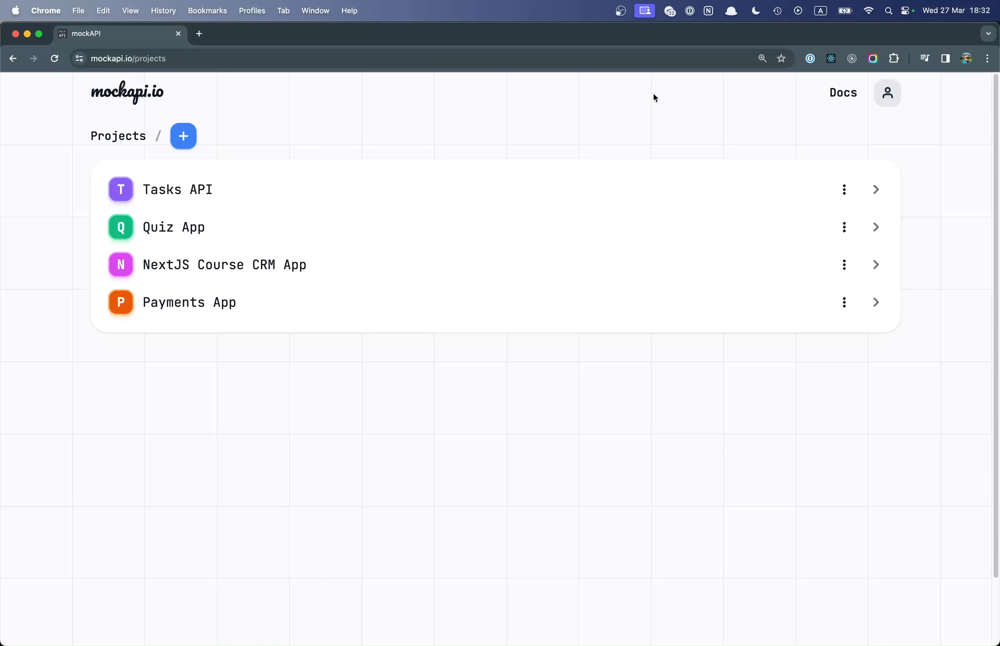

# goit-react-hw-07

## Книга контактів

Виконай рефакторинг коду застосунку «Книга контактів» із домашнього завдання попереднього модуля.

- Видали код, що відповідає за зберігання та читання контактів з локального сховища, тобто код пов’язаний з Redux Persist.
- Додай взаємодію з бекендом для зберігання контактів.

### Бекенд

Створи свій персональний бекенд для розробки за допомогою UI-сервісу [mockapi.io](https://mockapi.io/). Зареєструйся використовуючи свій обліковий запис GitHub та обери безкоштовний план.

Переглянь демо-відео, як створити бекенд-застосунок та конструктор ресурсу, щоб отримати ендпоінт `/contacts`.

[](./public/a90c8b29-b59a-4052-a3c9-92987e8c81092024-03-27.mp4)

### Форма стану

Додай у стан Redux обробку індикатора завантаження та помилки HTTP-запитів. Для цього зміни форму стану слайсу контактів, додавши властивості `loading` та `error`.

```js
{
  contacts: {
    items: [],
    loading: false,
    error: null
  },
  filters: {
		name: ""
	}
}
```

### Операції

В папці `redux` створи файл `contactsOps.js` для зберігання асинхронних генераторів екшенів.

- Використовуй функцію [createAsyncThunk](https://redux-toolkit.js.org/api/createAsyncThunk) для оголошення операцій.
- Для виконання HTTP-запитів використай бібліотеку [axios](https://axios-http.com/uk/docs/intro).

Оголоси наступні операції:

- `fetchContacts` - одержання масиву контактів (метод GET) запитом. Базовий тип екшену це рядок `"contacts/fetchAll"`.
- `addContact` - додавання нового контакту (метод POST). Базовий тип екшену це рядок `"contacts/addContact"`.
- `deleteContact` - видалення контакту по ID (метод DELETE). Базовий тип екшену це рядок `"contacts/deleteContact"`.

Для коректного опрацювання помилки HTTP-запиту в середині операцій, використай конструкцію `try...catch`, та у блоці `catch` поверни результат виклику методу `thunkAPI.rejectWithValue`.

Обробку усіх трьох екшенів (fulfilled, rejected, pending) та зміну даних у стані Redux зроби у властивості `extraReducers` слайсу контактів, а от властивість `reducers` з нього — прибери.

### Мемоізація селекторів

Після додавання властивостей `loading` та `error` у слайс контактів, виникне проблема оптимізаціі фільтрування контактів, так як вираз фільтрування буде виконуватись не тільки при зміні контактів або фільтру, а також при зміні `loading` та `error`.

Для вирішення цієї задачі:

- У файлі слайсу контактів `contactsSlice.js` створи та експортуй мемоізований селектор `selectFilteredContacts` за допомогою функції [createSelector](https://redux-toolkit.js.org/api/createSelector).
- Селектор повинен залежати від поточних масиву контактів і значення фільтра, та повертати відфільтрований масив контактів.
- Селектор `selectFilteredContacts` імпортується у компонент списка контактів `ContactList.jsx` та використовується у `useSelector`.

### Колекція контактів

Оскільки твоя колекція контактів тепер зберігається на бекенді, то:

- При завантаженні додатка запит на бекенд для отримання масиву контактів зроби саме в компоненті `Арр`.
- При створенні нового контакту додавати йому унікальний ідентифікатор більше не потрібно, це буде робити сам бекенд і повертати у відповідь об’єкт нового контакту.
